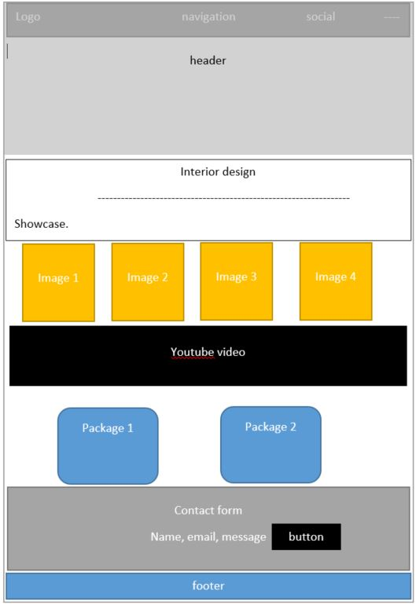
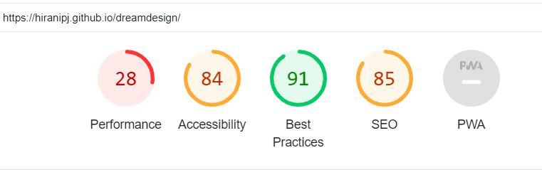

<h1><b>Dream Designs README</b></h1>

<h3>Project Name</h3>
Dream Designs

<h3>Description</h3>

Dream Designs is a cutting-edge interior design company that transforms everyday spaces into bespoke environments that resonate with our clients' aspirations. With a focus on creativity, functionality, and customer-centric design, we strive to bring a unique vision to life in every project we undertake. Our website serves as a digital portfolio and a gateway for clients to discover and engage with our services.

<h3>User Stories</h3>
<ol type="1.">
<li>As a new visitor, I want to understand Dream Designs' services so I can decide if they fit my needs.</li>
<li>As a potential client, I want to see examples of past projects to gauge the quality and style of the designs.</li>
<li>As an interested customer, I want to easily navigate through the different service packages to choose what’s best for me.</li>
<li>As a client, I want to contact Dream Designs easily to start my home design project.</li>
</ol>

<h2>Features</h2>
<h3>Home Page</h3>

The home page is the digital front door of Dream Designs, inviting users with a stylish and elegant layout that reflects our commitment to aesthetic excellence. The header integrates seamless navigation and social media links, ensuring visitors can explore our work and connect with us effortlessly.

<h3>Showcase (gallery) Page</h3>

This page is a gallery of transformation, featuring a curated selection of images from our extensive portfolio. Each image represents our passion for design, hinting at the depth of customization and attention to detail we bring to every space.

<h3>Showcase (video) page</h3>

A multimedia section that brings our designs to life through video content. It offers a more dynamic look at our projects, allowing potential clients to envision the possibilities for their own spaces.

<h3>Packages Page</h3>

Here we detail the design packages available, from basic consultations to premium services. This page is designed to offer transparent information about what each package includes and the value it provides.

<h3>Contact Form</h3>

The contact page is the bridge between Dream Designs and our future clients. It's designed to be inviting and straightforward, encouraging visitors to reach out with their inquiries and design dreams.

<h2>Wireframes</h2>

The wireframes provide a blueprint of the website's structure, presenting a clear and organized layout that prioritizes user experience and intuitive navigation.

<h2>Accessibility Testing</h2>

We are committed to ensuring that our website is accessible to everyone. Regular accessibility testing is conducted to guarantee that users with disabilities can navigate our site with the same ease as all other users.For this we used lighthouse. we have a lot to improve

W3C Validator

Jigsaw validator

<h2>Manual Testing</h2>
<ol type="1.">
<li>All the nav links are linked to each sections</li>
<li>All the social links are working perfectly, it tastes you to its designated external sites</li>
<li>Contact button on the main banner takes you to contact section before the footer</li>
<li>All the Images on the gallery have an opacity over it , but wehn you hover around it, it appears.</li>
<li>The youtube video is set to play automatically , directly linked from youtube videos.</li>
<li>The packages buttons are not linked to its sign up form, but it takes you to the homepage when you click on it</li>
<li>The contact forms reuired is notified when you press submit filling filling in all the textbox</li>

</ol>

<h1>Deployment</h1>
<h2>Cloning & Forking</h2>
<h3>Fork</h3>
<ol type="1.">
<li>On GitHub.com, navigate to the HiraniPJ/dreamdesign repository.</li>
<li>In the top-right corner of the page, click Fork.</li>
<li>By default, forks are named the same as their parent repositories. You can change the name of the fork to distinguish it further.</li>
<li>Add a description to your fork to indicate that this is your personal copy or a place where you're planning to propose changes.</li>
<li>Click Create fork.</li>
<h3>Clone</h3>
<ol type="1.">
<li>Above the list of files, click the button that says 'Code'.</li>
<li>Copy the URL for the repository.</li>
<li>Open Terminal. Change the directory to the location where you want the cloned directory.</li>
<li>Type git clone, and then paste the URL you copied earlier.</li>
<li>Press Enter.</li>
<h3>Local Deployment</h3>
<ol type="1.">
<li>Sign up to Gitpod or any other online IDE that suits your development needs.</li>
<li>Download the Gitpod browser extension for easy access.</li>
<li>On GitHub.com, navigate to the HiraniPJ/dreamdesign repository.</li>
<li>Above the list of files, click the button that says 'Gitpod'.</li>
<li>This will open a new Gitpod workspace with your cloned repository ready to use.</li>

<h2>Credits</h2>
https://unsplash.com/
https://boxicons.com/?query=youtub
